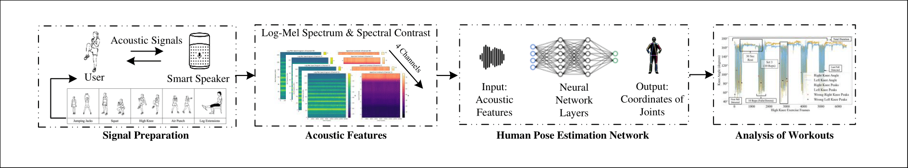

## **EchoMotion: Advancing Exercise Analysis with Acoustic Sensing**  

Welcome to **EchoMotion**, an innovative system that utilizes **active acoustic sensing** to analyze and monitor cardio exercises. By leveraging **inaudible acoustic signals** and **deep learning techniques**, EchoMotion estimates **3D human poses**, enabling precise exercise tracking in both **home and lab environments**.  

## **System Pipeline**  

The diagram below provides an overview of the **EchoMotion** processing pipeline:  

  

## **Demo Video**  

Watch a video demonstration of **EchoMotion** in action:  
[EchoMotion Demo](https://drive.google.com/file/d/1CbhDlujrwsqsnAC_k_kilr5kMl3OFkYN/view?usp=sharing)

## Getting Started

### Prerequisites

To run the EchoMotion scripts, ensure you have the following installed:

- Python 3.x
- pandas
- numpy
- scipy
- librosa
- tqdm
- matplotlib
- seaborn

Additionally, EchoMotion requires the `pipe_scripts` module in your Python path, which contains essential functions for feature extraction and analysis.

### Usage

The **`echomotion.ipynb`** script is designed to run in a Jupyter Notebook environment. It processes **acoustic data** collected from cardio exercises to estimate **3D pose skeletons**. The following configurations should be set:

- `acoustic_data_folder`: Path to the directory containing recorded .wav files.
- `ground_truth_folder`: Path to the directory containing Kinect ground truth pose data.
- `cell_locations`: A dictionary mapping key joints (e.g., shoulders, elbows, knees) to their corresponding positions in the data files.

## Data Collection

The **EchoMotion dataset** comprises over **11 hours of synchronized acoustic and ground truth pose data**, recorded from **22 participants** performing **five cardio exercises**:

- Jumping Jacks
- High Knees
- Squats
- Air Punches
- Seated Leg Extensions

Each session lasted **6 minutes per exercise**, recorded in **both living room and lab settings** using:

- **Microphone array** (MiniDSP UMA-8 V2.0)
- **Speaker** (Bose Companion 2) for tone generation
- **Azure Kinect DK** for 3D pose ground truth

We use **inaudible ultrasound frequencies (17 kHz - 21 kHz)** to capture body motion reflections while minimizing environmental noise interference.

### Dataset Availability

The dataset will be published **once the associated research publication is accepted**. The dataset and related materials will be available at **[link will be updated upon release]**.

## About the Project

EchoMotion provides a **non-invasive, privacy-conscious** alternative to conventional exercise monitoring methods. The system is designed to:

- Utilize **acoustic reflections** for accurate 3D pose estimation
- Offer a **cost-effective** alternative to vision-based or wearable tracking systems
- Enable **home-based exercise monitoring** with real-time feedback

For further details, please refer to the **`echomotion.ipynb`** notebook, which contains the full implementation and analysis.

### Code Availability

The source code will be published **alongside the dataset** at:
**[link will be updated upon release]**.

## License

**EchoMotion** is developed at the **University of Southampton**. All rights reserved.

For licensing details, please check the [License](License) file.
